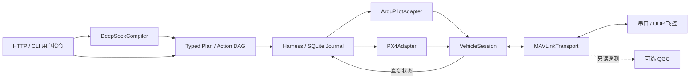

# 架构与扩展

## 分层

`contracts.py` 定义业务原子动作、坐标与依赖契约，无串口或 SDK。`compiler.py` 用 DeepSeek 的 JSON 输出生成计划，并在本地重新校验；该调用层可换成其他 provider，不影响控制器。

`runtime.py` 实现多机 DAG 调度、每机租约、取消及 UNKNOWN 核实。`journal.py` 持久化幂等请求键、原计划、任务状态、结果和协议事件。就绪动作按批并发；本批完成后才派发后继。本版本不含编队避碰、轨迹优化或任务上传服务。

`adapters.py` 中公共动作逻辑负责条件和遥测完成判断；ArduPilot/PX4 子类各自实现起飞准备、参数、高度基准、移动模式、降落及原生保持。新增后端要实现同一接口并注册 factory，不需要修改 DeepSeek 的业务动作格式。

`vehicle.py` 保存按 system/component ID 过滤的真实状态，核对固件与板卡、时效、估计器、模式和重启。固件/Home 属于会话元数据；动态消息有时效。位置目标在动作派发时冻结，20 Hz 发送循环独立于 LLM 请求。

`transport.py` 统一串口/UDP、MAVLink 2、心跳、定向 ACK 和遥测镜像；同一调制解调器链接可承载多个异构 system ID。每个目标命令串行等待回包，缺 ACK 不自动重试；ACK 的源和目标 GCS 地址都必须匹配。QGC 的界面、配置系统和代码不是依赖。

## 后端映射

| 动作 | ArduCopter 4.5 | PX4 1.16 |
|---|---|---|
| 普通解锁 | Guided；400 param1=1、param2=0 | 400 param1=1、param2=0 |
| 起飞 | 22，param7 为 Home 相对高度 | 22，param7 为 Home AMSL + 高度；未指定坐标用 NaN |
| 移动/保持 | Guided=4；LOCAL_NED 位置+yaw | 当前位置预发送；Offboard main=6；LOCAL_NED 位置+yaw |
| 降落 | mode=9 | 21；AUTO.LAND=(4,6) |
| 取消后的原生保持 | Brake=17 | AUTO.LOITER=(4,3) |
| 无 GPS 模型机起飞探针 | AltHold=2，22 param3=1，收尾 Land/disarm | 不开放 |

业务坐标以 `local_enu` 或 `body_flu` 表示，适配器转换成每架飞机自己的 LOCAL_NED。不会假定不同飞机的局部原点相同；本版本的“异构”是统一调度不同飞控后端，不是提供共享全球地图定位。

## 扩展与验证

动作白名单按飞机 profile 暴露，不能通过原始 MAV_CMD 绕过。新增动作应补参数契约、状态条件、后端映射、完成证据和协议测试。后续 PX4 固件版本可以显式配置 `firmware`，但配置通过不代表该版本已完成硬件验收。

原生 MAVLink command protocol 缺少通用事务 ID，故同一来源/命令在缺回包时不能安全地视为未执行。本版本选择持久化 UNKNOWN、禁止自动重放并要求状态核实；定向 ACK、每机串行命令与连接上的 poisoned ID 限制歧义。

参考：[MAVLink Command Protocol](https://mavlink.io/en/services/command.html)、[Pymavlink](https://mavlink.io/en/mavgen_python/)、[ArduPilot Guided Commands](https://ardupilot.org/dev/docs/copter-commands-in-guided-mode.html)、[PX4 1.16 Offboard](https://docs.px4.io/v1.16/en/flight_modes/offboard.html)、[DeepSeek JSON Output](https://api-docs.deepseek.com/guides/json_mode/)。目前 provider 使用 JSON 计划接口。
